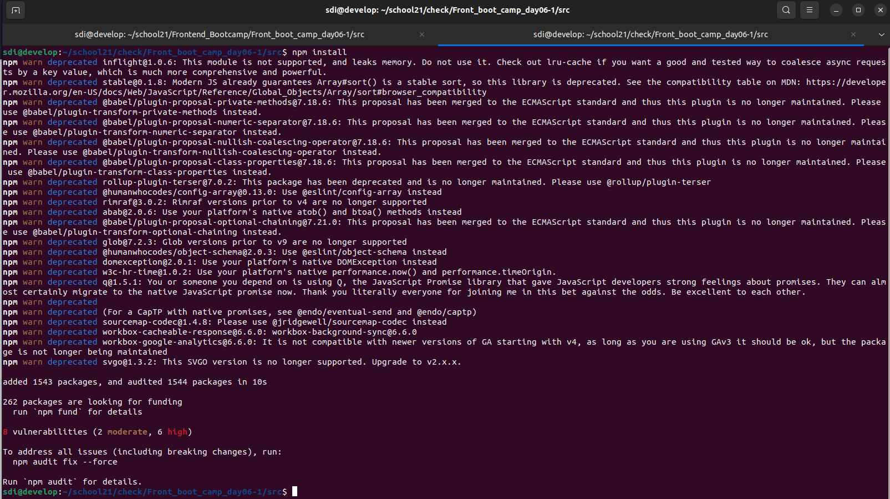
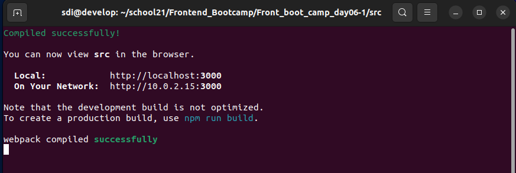
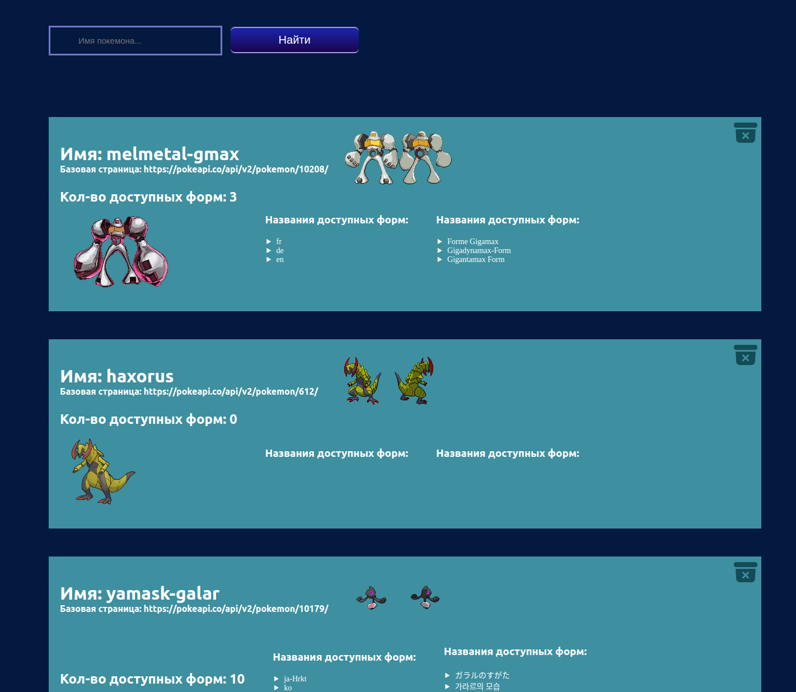
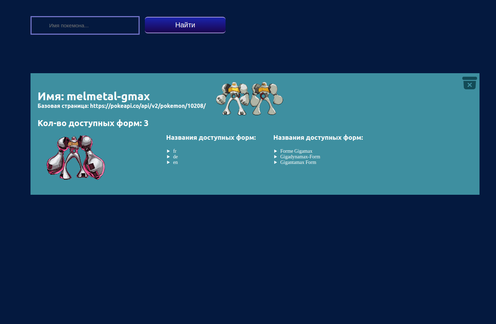

# find-pokemons
Working with api in react

### Сборка и настройка

 1. Для корректной работы, в системе должен быть установлен `Node JS` и `npm`

 2. Находясь в каталоге **src** необходимо запустить команду `npm install` которая запустит установку нужных пакетов и библиотек:

    

 3. Теперь нужно командой `npm run start` запустить сервер. При успешном запуске в консоле появится сообщение:

    

### Проверка работы

 1. Если после запуска сервера автоматически не открылась страница, то можно запустить ее вручную [Стартовая страница](http://localhost:3000/)  `localhost:3000/` - На стрнице будет отображено поле для ввода имени покемона:

    

 2. Если ввести несуществующее имя покемона или оставить поле пустым и нажать кнопку **`Найти`** то будет выведено сообщение `Такой покемон не найден!`:

   

 3. При вводе корректного имени покемона создается его карточка, где выводятся данные `имя покемона`, `Базовая ссылка на API`, так же получаем картинки и гифки покемона, выводим `количество доступных форм` и `названия доступных форм`(вот несколько имен покемонов для проверки: yamask-galar, haxorus, melmetal-gmax)

    

4. При нажатии на корзину с крестиком происходит удаление покемона из списка. Например удалим `yamask-galar` и `haxorus`, в списке останется только:

    

5. Если удалить все карточки, то появится надпись `Список покемонов пуст`

   
